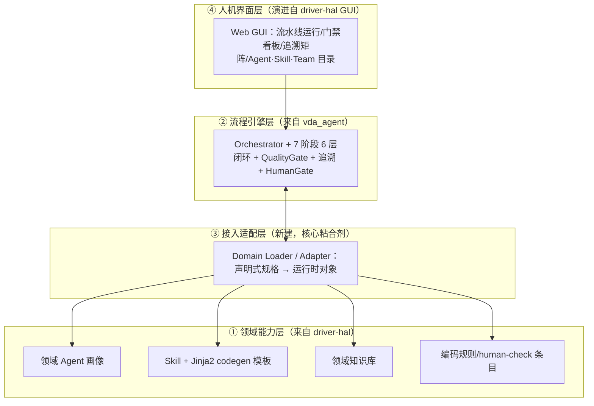

# 车载域控嵌入式软件开发 Agent 工程 · 合并可行性分析报告

## 0. 结论先行（TL;DR）

**可以合并，且二者强互补、低语义冲突。** 推荐**新建一个统一工程 `car-ecu-dev-agent`**，
把两者按职责重新分层整合，而非把一个塞进另一个。

- **为什么互补**：两者沿**正交轴**展开——
  - `driver-hal-develop` = **领域广度**（按驱动域组织的 10 个领域 Agent + 18 个 Skill + 代码生成模板 + 管理 GUI），但流程/门禁/工具多为**声明式 prose**，缺可执行引擎。
  - `vda_agent` = **流程深度**（按 V 模型阶段的可执行 6 层引擎 + 真实质量门禁 + 双向追溯 + 编排/replan），但只有**单一领域**示例。
  - 合并即构造「**驱动域 × V 模型流程**」二维能力矩阵：任一驱动模块（CAN/SPI/PMIC…）都能跑通需求→…→集成测试的合规闭环。
- **为什么低冲突**：两者**合规 DNA 完全一致**（AUTOSAR Classic / ISO 26262·ASIL / MISRA-C / ASPICE、human-check、双向追溯），术语与价值观对齐，不是"两套世界观"。
- **主要工作量在哪**：在**「声明式规格 ↔ 可执行引擎」的范式桥接**（写一个 adapter/loader），以及**重叠概念去重为单一真源**（工具、知识、门禁、human-check、追溯各一处）。
- **推荐架构（四层）**：
  1. **领域能力层**（来自 driver-hal）：领域 Agent 画像、Skill + codegen 模板、领域知识库、编码规则。
  2. **流程引擎层**（来自 vda_agent）：6 层内核 + 7 阶段流水线 + 质量门禁 + 追溯 + 编排。
  3. **接入适配层**（新建）：把声明式领域规格装载为引擎可消费的运行时对象。
  4. **人机界面层**（来自 driver-hal GUI 演进）：可视化驱动流水线运行、门禁、追溯、Agent/Skill 目录与团队。

> 一句话：**driver-hal 提供"做什么/哪个域"，vda_agent 提供"怎么做/合规闭环"，新建工程把二者焊在一起，GUI 作门面。**

---

## 1. 背景与目标

### 1.1 触发

用户已分别拥有两个面向车载嵌入式的 Agent 工程，希望评估能否把它们合并成**一个**统一的
"车载域控嵌入式软件开发 Agent 工程"。本报告回答三件事：

1. **能不能合**（可行性）；
2. **怎么合最合理**（推荐架构与集成映射）；
3. **分几步合、有什么风险**（路线图与风险）。

### 1.2 分析范围与依据

- 范围：架构与工程层面的合并可行性；**不含代码改动**。
- 依据：本次实际阅读的文件——
  - driver-hal：`README.md`、`CLAUDE.md`、`agent-router.md`、`TUTORIAL.md`、`project-context.md`、`agents/mcal-agent.md`、`agents/`+`skills/`+`gui/`+`tools/` 目录清单。
  - vda_agent：本仓库 `docs/车载域控嵌入式开发Agent设计方案.md` 与 `vda_agent/` 源码（已交付并验证可运行）。

---

## 2. 两工程画像与对比

### 2.1 driver-hal-develop 画像

- **定位**：面向汽车驱动 & HAL 层的多 Agent 协作工程，运行在 Siada / Claude-Code 式 LLM 运行时。
- **组织轴**：**驱动域**。`agents/` 含 mcal / pmic / communication / storage / safety / hsd-lsd / bridge / sensor / efuse 等领域专家。
- **Agent 形态**：富**声明式规格**（Markdown frontmatter + YAML），含 `workflows / skills / tools / rules / knowledges / multi-agent-collaboration / human_checks / output_formats / performance_metrics`。
- **Skill**：`skills/<域>/SKILL.md`，部分含**真实资产**（如 `tlf35584-enhanced` 带 Jinja2 代码生成模板 `.c.j2/.h.j2` + `consistency_checker.py`）；并有 meta-skill `create-automotive-agent/skill` 脚手架。
- **GUI**：`gui/server.py` + `index.html`，含 **Team（团队）管理**、`projects_config.json`，是 Agent/Skill 目录的可视化管理台（用户所说的 "Embedded Software Develop Agents Team" 即此 GUI 的团队概念）。
- **执行模型**：**LLM 运行时驱动**。`tools/static_analyzer`、`unit_test_runner`、`code_generator`、`hil_simulator` 等是**声明的工具名**，由 LLM 按 workflow 调用——**没有实际可执行引擎**。
- **`tools/` 现状**：大量 `fix_*/patch_*/check_*/find_*` 一次性脚本，是**开发 GUI 时的临时脚本**，非领域工具（合并时应排除）。

### 2.2 vda_agent 画像

- **定位**：通用 6 层 Agent 架构在车载域控的可执行落地；标准库即可离线运行。
- **组织轴**：**V 模型流程阶段**。7 阶段 Agent：需求→架构→详设→编码→评审→单测→集成测试。
- **形态**：**可执行 Python**。`BaseStageAgent.run()` 封装六层闭环；`Orchestrator` 串联阶段并支持 replan / 驳回上游。
- **基础设施（真实可跑）**：`ToolRegistry` + 6 工具桩（MISRA/ARXML/编译/单测/HIL/追溯）、`QualityGate` 质量门禁、双向追溯引擎、记忆四件套、`HumanGate`。
- **领域覆盖**：**单一**（车身域·电动车窗防夹 ASIL-B），靠 `stages/scenario.py` 提供确定性领域数据。

### 2.3 对比矩阵

| 维度 | driver-hal-develop | vda_agent |
|------|--------------------|-----------|
| 组织轴 | **驱动域**（横向广度） | **V 模型阶段**（纵向深度） |
| 执行模型 | 声明式，LLM 运行时（Siada）解释执行 | 命令式，Python 进程可执行 |
| 产物形态 | Markdown/YAML 规格 + Skill 模板 | Python 类 + 数据结构 + 可落盘工件 |
| 工具 | **声明名**（static_analyzer…），无引擎 | **真实** ToolRegistry + 6 工具桩 + 超时/熔断 |
| 质量门禁 | prose（workflow 里写"检查…"） | **可执行** `QualityGate.checks()` |
| 双向追溯 | 文档要求 + 输出模板 | **可执行**追溯引擎 + CSV 矩阵 |
| human-check | 丰富的 `human_checks` 条目（声明） | `HumanGate` + `RISK_LEVELS`（可执行） |
| 代码生成 | **有**（Jinja2 模板，真实资产） | 无（mock 模板/可接 LLM） |
| 领域知识 | `knowledge/`（数据手册/规范/模式/FAQ） | `knowledge/`（MISRA/ASPICE/状态机，较少） |
| GUI / 管理 | **有**（Team 管理、目录可视化） | 无 |
| 扩展机制 | meta-skill 脚手架生成 agent/skill | 继承 `BaseStageAgent` + 注册工具 |
| 领域覆盖 | **广**（多域） | **窄**（单一示例） |
| 合规标准 | AUTOSAR/ISO26262/MISRA/ASPICE | 同 |
| 成熟度 | 规格/GUI 完整，引擎缺失 | 引擎完整，领域/GUI 缺失 |

> **观察**：两表几乎处处**互补而非重复**——一方"有"的恰是另一方"缺"的。这是合并价值最高的形态。

---

## 3. 互补性与重叠分析

### 3.1 互补：域 × 流程矩阵

```
                V 模型流程（vda_agent 提供"怎么做"）
              需求  架构  详设  编码  评审  单测  集成
        MCAL   ·    ·    ·    ·    ·    ·    ·
驱  动  CAN    ·    ·    ·    ·    ·    ·    ·     ← driver-hal 提供
域 (driver SPI    ·    ·    ·    ·    ·    ·    ·       每个域的 Skill/
-hal 提供  PMIC   ·    ·    ·    ·    ·    ·    ·       知识/codegen/规则
"哪个域")  Flash  ·    ·    ·    ·    ·    ·    ·
        Safety  ·    ·    ·    ·    ·    ·    ·
        Sensor  ·    ·    ·    ·    ·    ·    ·
```

- 今天 driver-hal 在**行**上很全，但每个格子里的"流程"是 prose；
- 今天 vda_agent 在**列**上很实，但只有一行（车身防夹）有数据；
- 合并后：**每个格子都由可执行流程引擎驱动，并注入该域的领域能力**——这正是"统一工程"的本质。

### 3.2 重叠：需统一为"单一真源"的概念

两者都各自定义了以下概念，合并时**必须收敛到一处**（否则就是参考文档 Rule 7 所说的"最坏的 average 代码"）：

| 重叠概念 | driver-hal（声明） | vda_agent（可执行） | 合并取舍 |
|----------|--------------------|---------------------|----------|
| 静态分析工具 | `tools/static_analyzer`（名） | `tools/misra_checker.py`（实现） | **以 vda_agent 实现为真源**，兑现 driver-hal 的声明名 |
| 单元测试工具 | `tools/unit_test_runner`（名） | `tools/unit_test_runner.py`（实现） | 同上 |
| HIL | `tools/hil_simulator`（名） | `tools/hil_sil_runner.py`（实现） | 同上 |
| 代码生成 | Jinja2 模板（实现） | mock 模板（弱） | **以 driver-hal 模板为真源**，包装成 vda_agent 工具 |
| 领域知识 | `knowledge/`（丰富） | `knowledge/`（少） | **合并到一处知识库**，driver-hal 为主 |
| 编码规则 | `rules/coding-rules.md` | 门禁内常量 | 规则文件为真源 → 生成门禁配置 |
| human-check | `human_checks`（丰富条目） | `HumanGate`+`RISK_LEVELS` | 条目为数据，`HumanGate` 为执行器 |
| 追溯 | 输出模板要求 | 追溯引擎 | **以引擎为真源** |

> 原则：**声明式的一方贡献"内容/条目"，可执行的一方贡献"执行器"**；每个概念只有一个权威定义点。

---

## 4. 可行性结论

**结论：可行（推荐推进），属"中等工作量、低架构风险"的整合。**

分项判断：

| 判据 | 评估 | 说明 |
|------|------|------|
| 语义/术语对齐 | ✅ 强 | 同一套 AUTOSAR/ISO26262/MISRA/ASPICE/ASIL 世界观 |
| 架构互补性 | ✅ 强 | 域×流程正交，几乎无功能重复 |
| 范式差异 | ⚠️ 中 | 声明式 vs 命令式——是主要工作量，但可用 adapter 桥接，非阻塞 |
| 重叠去重 | ⚠️ 中 | 工具/知识/门禁/追溯需收敛单一真源，有明确取舍规则 |
| GUI 整合 | ⚠️ 中 | driver-hal GUI 需从"目录管理"扩展到"流水线运行可视化" |
| 数据迁移风险 | ✅ 低 | 领域规格是文本/模板，迁移安全可逆 |
| 既有资产保全 | ✅ 高 | 两侧核心资产都被保留并各展所长 |

**不建议的做法**：把 vda_agent 的 7 阶段直接塞进 driver-hal 当几个新 agent（会丢掉可执行引擎的门禁/追溯/编排），
或把 driver-hal 的领域 agent 硬翻译成 Python 类（会丢掉声明式可读性与 GUI 生态、且工作量巨大）。
**正确姿势是分层 + adapter**。

---

## 5. 推荐统一架构（新建工程 `car-ecu-dev-agent`）

### 5.1 四层架构



### 5.2 目录草案

```
car-ecu-dev-agent/
├── domains/                 # ① 领域能力层（迁移自 driver-hal）
│   ├── agents/              #   领域 Agent 画像（mcal/can/spi/pmic/...）
│   ├── skills/              #   Skill + codegen 模板（保留 Jinja2 资产）
│   ├── knowledge/           #   统一领域知识库（合并双方）
│   └── rules/               #   coding-rules / human-check 条目
├── engine/                  # ② 流程引擎层（迁移自 vda_agent/src/vda_agent）
│   ├── core/                #   六层 + BaseStageAgent + Orchestrator
│   ├── stages/              #   7 阶段 Agent（领域无关化：scenario 由 loader 注入）
│   └── tools/               #   真实工具（兑现 driver-hal 声明的工具名）
├── adapter/                 # ③ 接入适配层（新建）
│   ├── domain_loader.py     #   agent.yaml/SKILL.md → DomainProfile
│   ├── codegen_tool.py      #   包装 Jinja2 模板为引擎工具
│   └── gate_from_rules.py   #   rules/human_checks → QualityGate/HumanGate 配置
├── gui/                     # ④ 人机界面层（演进自 driver-hal/gui）
└── run.py                   # 入口：选域 + 选功能 → 跑 V 模型闭环
```

### 5.3 关键改造：阶段 Agent "领域无关化"

当前 vda_agent 的阶段 Agent 通过 `stages/scenario.py`（写死防夹车窗）取数据。
合并后改为：**loader 把所选驱动域的 `DomainProfile` 注入阶段 Agent**，
`produce()` 从 profile（领域知识 + skill 模板 + 规则）生成工件，而非写死场景。
这样同一套 7 阶段引擎可服务任意驱动域。

---

## 6. 集成映射表（最关键的工程契约）

### 6.1 产物 → 统一层归属

| 来源 | 产物 | 归入统一层 | 处理动作 |
|------|------|-----------|----------|
| driver-hal | `agents/*.md` 领域规格 | ① 领域能力层 | 解析为 `DomainProfile`（见 6.2） |
| driver-hal | `skills/*/SKILL.md` + `.j2` 模板 | ① + 包装为工具 | codegen 模板挂到 `codegen_tool` |
| driver-hal | `knowledge/` | ① 知识库 | 与 vda_agent 知识合并去重 |
| driver-hal | `rules/coding-rules.md` | ① 规则 | 生成门禁配置 |
| driver-hal | `gui/` | ④ 界面层 | 扩展为流水线可视化 |
| driver-hal | `tools/` 一次性脚本 | — | **丢弃**（GUI 开发残留） |
| vda_agent | `core/*` 六层 | ② 引擎层 | 直接迁入 |
| vda_agent | `stages/*` | ② 引擎层 | 去场景耦合，改为 profile 注入 |
| vda_agent | `tools/*` 工具 | ② 引擎层 | 作为真源，兑现 driver-hal 声明工具名 |
| vda_agent | `scenario.py` | — | 降级为"一个示例域 profile" |

### 6.2 声明式 → 可执行 的 adapter 契约

| driver-hal 声明字段 | 映射到 vda_agent 运行时 | 说明 |
|---------------------|--------------------------|------|
| agent `expertise/responsibilities/automotive_context` | `DomainProfile`（域元数据 + ASIL 范围） | 注入各阶段 Agent 作领域上下文 |
| agent `workflows.steps` | 阶段步骤蓝图 `step_blueprint()` 的领域定制 | prose 步骤 → 引擎步骤 |
| agent/skill `tools.required` | `ToolRegistry` 中的真实工具 | 声明名 → 已实现工具 |
| skill `SKILL.md` + `.j2` 模板 | `codegen_tool`（编码阶段产出） | 真正生成 `.c/.h/.arxml` |
| `knowledges` | `LongTermMemory` 知识源 | 召回进感知/生成 |
| `rules` (coding-rules) | `QualityGate` 检查项配置 | 规则 → 可执行门禁 |
| `human_checks` 条目 | `HumanGate` 触发条件 + `RISK_LEVELS` | 声明条件 → 执行门控 |
| `output_formats` | 阶段 `Artifact` 落盘模板 | 统一交付格式 |
| `performance_metrics` | 评测指标看板 | 接入 GUI 度量 |
| `multi-agent-collaboration` | `Orchestrator` 跨域协作编排 | 串行/并行/迭代协作 |

> 这张表就是后续写 `domain_loader.py` 的规格书——**每一行都是一个明确、可测的映射**。

---

## 7. 关键技术问题与取舍

1. **两执行范式如何统一？**
   - 取舍：**引擎层 Python 为主，声明式规格降级为"数据/配置"**。LLM（Claude）仍在引擎内部各阶段 `produce()` 中被调用做判断/生成，但**流程、门禁、追溯、编排由确定性 Python 执行**（符合"用模型做判断、用代码做路由"的原则）。
2. **Siada 运行时怎么办？**
   - driver-hal 现以 Siada 对话驱动。合并后**保留两种入口**：① GUI/CLI 触发 Python 引擎（确定性闭环）；② 仍可在 Claude-Code/Siada 中对话式调用（把引擎包装成一个可被对话触发的能力）。不强制二选一。
3. **GUI 对接 Python 引擎**：driver-hal 的 `gui/server.py` 已是 Python，**天然适合**作为引擎的前端——从"管理 Agent/Skill 目录"扩展出"启动流水线、看门禁红绿、看追溯矩阵、看 replan/驳回回环"。
4. **`tools/` 卫生**：driver-hal 的 `tools/` 绝大多数是 GUI 开发期临时脚本，**不进入**统一工程；统一工程的"工具"特指 vda_agent 那类领域工具。
5. **声明但未实现的工具兑现**：driver-hal 各 agent 反复引用 `static_analyzer/unit_test_runner/hil_simulator`，但无实现——**正好由 vda_agent 的对应工具落地兑现**，这是合并的即时增量价值。
6. **codegen 真源在 driver-hal**：vda_agent 编码阶段目前产出 mock/示例代码；driver-hal 的 Jinja2 模板是真实代码生成资产——合并后**编码阶段改用 driver-hal 模板**，质量立刻提升。

---

## 8. 分阶段合并路线图

| 里程碑 | 目标 | 主要动作 | 验收 |
|--------|------|----------|------|
| **M0 骨架** | 立统一工程结构 | 建 `car-ecu-dev-agent` 四层目录；迁移 vda_agent 引擎、driver-hal 领域资产（剔除 tools/ 垃圾） | 引擎在新工程内仍能跑通现有示例 |
| **M1 单域贯通 PoC** | 一个域跑通 V 模型 | 写 `domain_loader`，把 **CAN 或 TLF35584** 域 profile 注入 7 阶段；编码阶段接 Jinja2 模板 | 该域端到端产出 7 工件 + 追溯 + 门禁全绿 |
| **M2 多域接入** | 覆盖多驱动域 | 批量装载 driver-hal 领域 agent/skill；统一知识库去重；规则→门禁配置 | ≥5 个域可跑闭环 |
| **M3 GUI 对接** | 可视化运行 | 扩展 driver-hal GUI：流水线启动、门禁看板、追溯矩阵、Team 编排 | GUI 可发起并观测一次完整闭环 |
| **M4 治理/CI** | 工程化 | 统一 human-check 策略、评测集、CI 冒烟、文档 | CI 绿、文档齐、可对外用 |

> 建议**先做 M1（单域 PoC）验证 adapter 契约**再投入 M2+；PoC 成本低、最能证伪/证实本报告结论。

---

## 9. 工作量与风险评估

| 风险 | 等级 | 表现 | 缓解 |
|------|------|------|------|
| 范式阻抗（声明↔命令） | 中 | adapter 映射不全/语义丢失 | 以 §6.2 映射表为契约，逐字段测试；先 M1 验证 |
| 重复真源未收敛 | 中 | 工具/知识/门禁两处各一份，行为漂移 | 按 §3.2 取舍表，每概念只留一个权威点 |
| 阶段 Agent 去场景化改造 | 中 | scenario 写死耦合较深 | 引入 `DomainProfile` 注入点，scenario 降级为示例 profile |
| GUI 耦合度 | 中 | GUI 与旧目录结构强绑定 | GUI 仅通过引擎 API 交互，不直接读旧目录 |
| 领域 spec 质量参差 | 低-中 | 个别 agent/skill 规格不全（如 `123test`/`test888`） | 装载前做 spec 校验，剔除占位/测试件 |
| Siada 依赖 | 低 | 对话入口行为差异 | 双入口并存，不强制迁移 |
| 既有资产回归 | 低 | 迁移破坏现有可运行性 | M0 先保证引擎在新壳内回归通过 |

**粗估工作量**：M0+M1（骨架 + 单域 PoC）约为小规模可控投入；M2–M4 视接入域数量与 GUI 深度递增。
**总体属"中等工作量、低架构风险"**——架构上没有不可调和的冲突，难点是工程整合而非概念冲突。

---

## 10. 附：决策点清单（推进前需你拍板）

1. **统一工程命名与落位**：`car-ecu-dev-agent`？放在 `D:\AI\` 下新建仓库还是某一方仓库内？
2. **入口形态优先级**：先做 GUI 驱动，还是先做 CLI/Python 驱动（建议先 CLI 跑通 M1，GUI 放 M3）？
3. **M1 试点域**：选哪个域做单域 PoC？建议 **TLF35584**（driver-hal 已有真实 Jinja2 模板 + checker，最能验证 codegen 接入）或 **CAN**（最通用）。
4. **Siada 入口去留**：是否保留对话式调用入口，还是统一为引擎 + GUI？
5. **既有两工程处置**：合并后原 `driver-hal-develop` / `vda_agent` 作为只读归档，还是逐步停用？
6. **codegen 策略**：编码阶段以 Jinja2 模板为主、LLM 为辅，还是反之？

---

## 结语

`driver-hal-develop` 与 `vda_agent` 不是两个竞争方案，而是一枚硬币的两面：
**一个解决"覆盖哪些驱动域"，一个解决"如何合规地把每个域做完整闭环"。**
合并成一个统一工程在技术上**可行且价值明确**——它能立刻把 driver-hal 里"声明却未落地"的流程/工具/门禁/追溯，
用 vda_agent 的可执行引擎兑现；又能把 vda_agent 单薄的领域覆盖，用 driver-hal 的领域资产撑满。

建议下一步：**确认 §10 决策点 → 启动 M1 单域 PoC** 来实证本报告的集成契约。

> 相关文档：[车载域控嵌入式开发Agent设计方案.md](车载域控嵌入式开发Agent设计方案.md)、
> [车载域控开发Agent使用说明手册.md](车载域控开发Agent使用说明手册.md)、
> [vda_agent/README.md](../vda_agent/README.md)。
