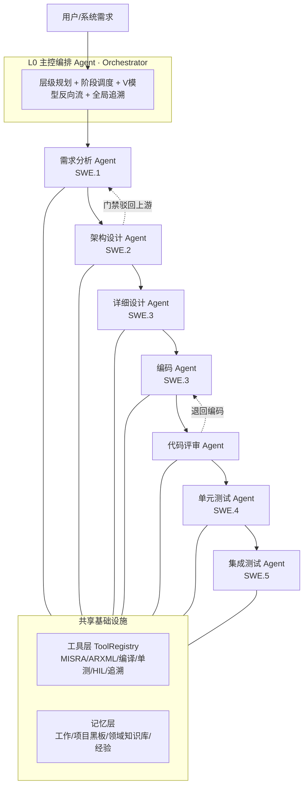
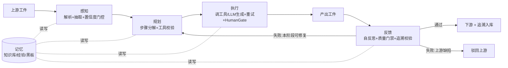

# 车载域控嵌入式软件开发 Agent · 设计方案

> 本方案把通用的 **6 层 Agent 架构**（感知 / 规划 / 工具 / 记忆 / 执行 / 反馈）
> 落地到 **车载域控嵌入式软件开发**，覆盖 ASPICE / V 模型的完整研发闭环：
> 需求分析 → 架构设计 → 详细设计 → 编码 → 代码评审 → 单元测试 → 集成测试。
>
> 配套可运行脚手架见 [`vda_agent/`](../vda_agent/README.md)，
> 端到端样例见 [`vda_agent/examples/anti_pinch_window/`](../vda_agent/examples/anti_pinch_window/README.md)。

---

## 0. TL;DR（一页总览）

- **一句话**：用一个 **主控编排 Agent** 驱动 **7 个研发阶段专家 Agent**；每个阶段 Agent 自身又是一个完整的 **6 层闭环**，把 ASPICE/ISO 26262/MISRA 的验收准则编码为**质量门禁**，全程维护**双向追溯**。
- **为什么**：车载域控开发流程重、合规约束硬、工件多、阶段间手工传递易丢追溯。Agent 把每个 V 模型环节自动化，并用门禁强约束质量与合规——这正是「Demo」与「产品」的差别（参考文档结论）。
- **核心映射**：

  | 通用 6 层 | 车载域控落地 |
  |-----------|--------------|
  | 感知 | 解析需求/ARXML/C 代码/测试报告，抽取 ASIL·CAN 信号·时序约束，置信度门控 |
  | 规划 | 阶段内步骤分解（Plan-then-Execute），渐进式 replan，工具可用性校验 |
  | 工具 | MCP 风格车载工具：MISRA 检查 / ARXML / 交叉编译 / 单测 / HIL / 追溯 |
  | 记忆 | 工作记忆 + 项目黑板 + 领域知识库（MISRA/ASPICE/模式）+ 经验记忆 |
  | 执行 | 重试 / 沙箱式工具执行 / HumanGate 人类确认门控（刷写、入库基线） |
  | 反馈 | 自我反思 + **质量门禁** + 双向追溯校验 → continue/retry/replan/驳回上游/升级 |

- **闭环的关键不是「LLM 写代码」，而是「门禁 + 追溯」**：每个阶段产出都必须过本阶段验收准则，且与上下游双向可追溯，否则反馈层驳回。

---

## 1. 背景与目标

### 1.1 痛点

车载域控（车身/底盘/动力域 MCU）软件遵循 **ASPICE + V 模型 + ISO 26262**，特点是：

- **流程重**：SWE.1~SWE.6 每个过程都有规定的输入/输出工件与验收。
- **合规硬**：MISRA C 强制类违规须清零；ISO 26262 要求 ASIL 分解、安全机制、结构覆盖率（分支 / MC-DC）。
- **追溯严**：需求 ↔ 架构 ↔ 详设 ↔ 代码 ↔ 单测 ↔ 集成测试**双向可追溯**（SUP.10），变更需影响分析。
- **工件碎**：跨工具（DOORS/DaVinci/QAC/Tessy/CANoe…）手工搬运，追溯链极易断裂。

### 1.2 目标

构建一个能驱动**完整研发闭环**的 Agent 系统：输入一句（或一份）需求，自动产出需求规格→架构→详设→代码→评审→单测→集成测试的全套工件，并保证：

1. 每个阶段产出**过质量门禁**（合规即门禁）；
2. 全程**双向追溯**自动维护；
3. 高风险动作（基线入库、ECU 刷写）**人类确认**；
4. 门禁失败可**自修复（replan）或驳回上游**（V 模型反向流）；
5. 全链路**可追溯、可审计**（每个决策可回放）。

---

## 2. 总体架构：6 层 × V 模型多 Agent

### 2.1 拓扑（层级规划，对应参考文档"范式 4"）



- **L0 战略层**：Orchestrator 把"完成一个功能的 V 模型闭环"分解为 7 个阶段，按序驱动；
- **L1 阶段层**：每个阶段一个专家 Agent；
- **L2 执行层**：每个阶段 Agent 内部是完整 6 层闭环。

> 这与参考文档的层级规划一致：**高层用大模型做决策，底层用专用工具/小模型做执行**。

### 2.2 单个阶段 Agent 的 6 层闭环



对应脚手架：[`core/base_agent.py`](../vda_agent/src/vda_agent/core/base_agent.py) 的 `BaseStageAgent.run()` 即此闭环；
编排与反向流见 [`core/orchestrator.py`](../vda_agent/src/vda_agent/core/orchestrator.py)。

### 2.3 V 模型双向流

前向是瀑布（产出工件），反向由门禁触发：

- **本阶段可修复**（如 MISRA 违规、覆盖率不足）→ `REPLAN`，依据工具反馈重做（自修复）。
- **上游缺陷**（如架构无法满足某需求、需求不可验证）→ `REJECT_UPSTREAM`，回退上一阶段重做，受 `max_backtrack` 预算约束。

---

## 3. 六层在车载域控的落地

逐层说明"做什么 / 关键技术 / 踩坑"。每层对应脚手架文件，类名尽量与参考文档一致。

### 3.1 感知层（`core/perception.py`）

**做什么**：把上游工件归一化为 `StructuredInput`，抽取意图·实体·约束，做**置信度门控**。

车载语境的输入类型与抽取目标：

| 输入 | 抽取目标 |
|------|----------|
| 自然语言/系统需求 | 意图、ASIL、CAN 信号名、时序（ms）、力（N）、约束 |
| ARXML / 架构 | 组件、端口、接口、Runnable 周期 |
| C 代码 | 函数、状态机、标定量、MISRA 相关构造 |
| 工具返回（MISRA/编译/覆盖率/HIL） | 结构化解析返回值，**不靠 LLM 自行判断成败** |

**关键设计**：置信度 < 0.7 抛 `AmbiguousInputError` 主动澄清（如用户未给 ASIL）。

**踩坑**：

| 坑 | 解法 |
|----|------|
| 意图漂移（多轮后忘了原始需求） | 每轮注入原始需求锚点（写入工作记忆 high 优先级） |
| 环境误读（把工具报错当成功） | 结构化校验返回值，门禁只认结构化字段 |
| 多模态噪声（原理图 OCR 噪声） | 预处理只保留结构化信息 |

### 3.2 规划层（`core/planning.py`）

**做什么**：把阶段目标拆成步骤序列。采用 **Plan-then-Execute + 渐进式 replan**。

- 每个阶段 Agent 用 `step_blueprint()` 声明步骤蓝图（含要调用的工具）；
- `PlanManager.create_plan()` 生成计划并做**工具可用性校验**（防"规划幻觉"——引用不存在的工具）；
- `replan()` 只在失败步骤处插入"修正后重试"，保留已完成步骤（避免全量重规划）。

**指标**：规划成功率 >80%、重规划 <2 次、步骤效率 <1.5x。

**踩坑**：规划幻觉→生成后校验工具；过度规划→设最大步骤数；规划僵化→渐进式 replan。

### 3.3 工具层（`core/tools.py` + `tools/`）

**做什么**：把 LLM 的语言能力转成对车载工具链的操作能力。MCP 风格 `Tool` 基类 + `ToolRegistry`（热插拔、语义发现、参数校验、超时/熔断）。

车载工具分类与本方案的桩实现 → 真实对接：

| 类别 | 工具（脚手架桩） | 真实对接 |
|------|------------------|----------|
| 静态分析 | `misra_checker` | Helix QAC / Polyspace / Coverity |
| 架构建模 | `autosar_arxml` | Vector DaVinci / EB tresos |
| 构建 | `compiler` | AURIX tricore-gcc / NXP S32 gcc |
| 单元测试 | `unit_test_runner` | Tessy / VectorCAST（gcov, MC-DC） |
| 集成/在环 | `hil_sil_runner` | CANoe(vTESTstudio) / dSPACE HIL |
| 追溯 | `traceability` | Polarion / DOORS / Codebeamer |

**关键原则**（参考文档）：

- **最小权限**：查 MISRA 的工具不该能刷写 ECU（`risk` 字段分级）。
- **幂等性**：工具尽量幂等，支撑重试。
- **超时与熔断**：每次调用带超时；连续失败熔断（`_CircuitBreaker`）。

### 3.4 记忆层（`core/memory.py`）

四类记忆：

| 记忆 | 内容 | 生命周期 |
|------|------|----------|
| 工作记忆 `WorkingMemory` | 当前阶段上下文（滑窗+摘要压缩） | 单阶段 |
| 项目黑板 `ShortTermMemory` | 阶段间共享工件/决策（如 `artifact:requirement`） | 单次研发任务 |
| 长期记忆 `LongTermMemory` | 领域知识库：MISRA 规则、ASPICE、状态机模式 | 永久（`knowledge/`） |
| 经验记忆 `ExperienceMemory` | 阶段成功/失败案例，**失败优先回放** | 永久 |

> 长期记忆当前用本地知识文件 + 关键字检索；生产可平替向量库（Chroma/Milvus），`store/recall` 接口不变。
> 经验记忆把"上次 MISRA 在哪类写法翻车""上次覆盖率卡在哪个分支"沉淀为可复用教训。

### 3.5 执行层（`core/execution.py`）

**做什么**：把计划步骤转成工具调用，管理重试/超时，并对高风险动作做 **HumanGate** 人类确认。

- **沙箱**：代码编译、单测、HIL 都在隔离工具桩中执行（默认禁网、产出大小受限），与参考文档 `SandboxedCodeExecutor` 同构。
- **人类确认门控**：风险分级 `RISK_LEVELS`，`>= DELETE` 需确认：

  | 等级 | 车载示例 | 处置 |
  |------|----------|------|
  | READ/CREATE | 读代码、生成工件 | 自动 |
  | MODIFY | 改源码 | 记录日志 |
  | DELETE | 删基线工件 | 需确认 |
  | BASELINE | 配置入库/打基线 | 需确认 |
  | IRREVERSIBLE | **ECU 刷写 / 合入主干** | 双重确认 |

### 3.6 反馈层（`core/feedback.py`）

**做什么**：自我反思 + **质量门禁** + 从反馈学习。这是车载场景**最重的一层**——合规即门禁。

- `SelfReflection`：结果有效性 / 目标进展 / 异常（如追溯缺口）检测；
- `QualityGate`：每个阶段子类化，把 ASPICE/ISO26262/MISRA 验收准则编码为可执行检查项；
- 裁决：`continue / retry / replan / reject_upstream / escalate`；
- 在线学习：把通过/失败教训写回工作记忆（high 优先级，不被压缩）；经验记忆离线沉淀失败模式。

三种反馈来源：

| 类型 | 车载来源 | 示例 |
|------|----------|------|
| 环境反馈 | 工具返回值 | 编译 errors、MISRA 违规数、覆盖率、HIL 通过率 |
| 自我反馈 | Agent 自评 | "这版代码能过 MISRA 与单测吗？" |
| 人类反馈 | 评审意见 | "防夹阈值要做成可标定" → 记入经验记忆 |

---

## 4. 研发闭环：7 个阶段 Agent 详解

每个阶段用统一模板描述：**上游输入 / 感知 / 规划(步骤+工具) / 记忆 / 产出 / 反馈门禁 / 追溯**。
门禁项即各阶段 `QualityGate.checks()`（见对应 `stages/*.py`）。

### 4.1 需求分析 Agent（SWE.1）

| 维度 | 内容 |
|------|------|
| 上游 | 用户自然语言 + 系统需求 |
| 感知 | 抽取 ASIL、信号、时序、力约束；缺 ASIL 触发澄清 |
| 规划 | ①结构化需求 ②`traceability` 校验 |
| 产出 | 软件需求规格 SRS（功能/安全/时序/接口 + 验收准则） |
| 门禁 | 每条需求可验证（有验收准则）；安全需求标注 ASIL；需求→系统需求追溯 100% |
| 追溯 | REQ-* `derives` 系统需求 |

### 4.2 架构设计 Agent（SWE.2）

| 维度 | 内容 |
|------|------|
| 上游 | SRS |
| 规划 | ①划分 SWC/端口/接口/Runnable ②`autosar_arxml` 生成+校验 ③`traceability` |
| 产出 | 软件架构 SAD + ARXML |
| 门禁 | ARXML 一致（端口接口齐全、引用解析）；实时控制周期已定义；架构→需求追溯 100% |
| 追溯 | ARC-* `satisfies` REQ-* |

### 4.3 详细设计 Agent（SWE.3）

| 维度 | 内容 |
|------|------|
| 上游 | SAD |
| 规划 | ①状态机+迁移表 ②防夹算法+时序预算 ③`traceability` |
| 产出 | 软件详细设计 SDD（状态机、算法、时序、标定量） |
| 门禁 | 状态机完备（含 default 防御）；安全机制已设计；详设→架构/需求追溯 100% |
| 追溯 | DSN-* `satisfies` REQ-* |

### 4.4 编码 Agent（SWE.3）

| 维度 | 内容 |
|------|------|
| 上游 | SDD |
| 规划 | ①生成 `.c/.h` ②`misra_checker` ③`compiler` |
| 产出 | MISRA C 源码 |
| 门禁 | 无 blocker/major MISRA 违规；违规密度 ≤ 5/kLOC；编译通过 |
| 反馈 | 门禁失败 → **REPLAN**：依据 MISRA 反馈自修复（脚手架 `--inject-defect` 可复现） |

### 4.5 代码评审 Agent

| 维度 | 内容 |
|------|------|
| 上游 | 源码 |
| 规划 | ①同行/LLM 评审归纳评审项 ②`misra_checker` 复核 ③`traceability` 缺口校验 |
| 产出 | 评审报告（MISRA 复核、缺陷、风格、追溯缺口） |
| 门禁 | 无 blocker/major 评审项；MISRA 复核零严重违规；无追溯孤儿项 |
| 反馈 | 源码缺陷→REPLAN(退编码)；需求/设计缺陷→REJECT_UPSTREAM |

### 4.6 单元测试 Agent（SWE.4）

| 维度 | 内容 |
|------|------|
| 上游 | SDD + 源码 |
| 规划 | ①设计用例(等价类/边界/防夹触发/防御) ②`unit_test_runner` 执行+覆盖率 ③`traceability` |
| 产出 | 单元测试规格与结果 |
| 门禁 | 用例全通过；分支覆盖 ≥90%(ASIL B)；MC/DC ≥80%；用例→需求追溯 100% |
| 追溯 | TC-UT-* `verifies` REQ-* |

### 4.7 集成测试 Agent（SWE.5）

| 维度 | 内容 |
|------|------|
| 上游 | SAD + 源码 |
| 规划 | ①设计集成场景(CAN 交互/端到端防夹/堵转) ②`hil_sil_runner` 在环执行 ③`traceability` |
| 产出 | 集成测试报告（信号交互、端到端防夹、实时时序） |
| 门禁 | 场景全通过；端到端反应时间 ≤100ms；用例→需求追溯 100% |
| 追溯 | TC-IT-* `verifies` REQ-* |

---

## 5. 端到端贯穿示例：电动车窗防夹（串联 6 层 × 7 阶段）

完整工件见 [`examples/anti_pinch_window/`](../vda_agent/examples/anti_pinch_window/README.md)。脚手架实跑日志（节选）：

```
用户："上升中夹到手 100ms 内反转，夹持力≤100N，CAN 通信，10ms 周期，ASIL B"
[感知] intent=elicit_requirements 实体={asil:B, timing:[100,10], force:100} 置信度=0.90
[需求] → REQ-APW-001..006（含安全/时序/接口 + 验收准则）  门禁:SWE.1 ✅
[架构] → ApwCtrl SWC + 端口/接口 + 10ms Runnable + ARXML   门禁:SWE.2 ✅
[详设] → 5 态状态机 + 防夹算法(电流阈值+去抖+反转+软停区)  门禁:SWE.3 ✅
[编码] → AntiPinch.c（MISRA 0 违规）                       门禁:MISRA+编译 ✅
        (若注入缺陷：门禁❌ → 依 MISRA 反馈渐进式重做 → ✅)
[评审] → 同行评审 + MISRA 复核（无 blocker）               门禁:评审 ✅
[单测] → 6 用例，分支 96% / MC-DC 88%                      门禁:SWE.4 ✅
[集成] → HIL 端到端：反应 85ms，峰值力 92N                 门禁:SWE.5 ✅
闭环结果：7/7 阶段门禁通过；REQ-APW-001..006 全程双向可追溯
```

这正是参考文档"6 层协同的完整例子"在车载域的对应：感知澄清→规划分解→工具执行→记忆调取→门禁反馈→（必要时）replan/驳回。

---

## 6. 质量门禁与合规体系

### 6.1 ASPICE 工件映射

| 过程 | 产出 | 对应 Agent |
|------|------|-----------|
| SWE.1 | SRS | 需求分析 |
| SWE.2 | SAD + ARXML | 架构设计 |
| SWE.3 | SDD + 源码 | 详设 / 编码 |
| SWE.4 | 单元测试规格/结果 | 单元测试 |
| SWE.5 | 集成测试规格/结果 | 集成测试 |
| SWE.6 | 合格性测试（可扩展） | — |

### 6.2 双向追溯矩阵

每个阶段产出携带 `trace_links`，编排器汇总成矩阵（[CSV 示例](../vda_agent/examples/anti_pinch_window/traceability_matrix.csv)）：

```
REQ-APW-002 ──derives──► SYS-PWR-011         (需求→系统)
ARC-SWC-CTRL ─satisfies─► REQ-APW-002         (架构→需求)
DSN-APW-PINCH ─satisfies─► REQ-APW-002        (详设→需求)
AntiPinch.c ──implements─► DSN-APW-PINCH       (代码→详设)
TC-UT-002 ──verifies──► REQ-APW-002           (单测→需求)
TC-IT-002 ──verifies──► REQ-APW-002           (集成→需求)
```

追溯工具检测**孤儿项**（无上游或无下游覆盖），任一阶段追溯 <100% 即门禁不过。

### 6.3 合规门禁项（编码为可执行检查）

| 标准 | 门禁项 | 落点 |
|------|--------|------|
| MISRA C:2012 | 强制类违规清零、密度 ≤5/kLOC | 编码/评审门禁 |
| ISO 26262 | ASIL 标注、安全机制、分支/MC-DC 覆盖 | 需求/详设/单测门禁 |
| ASPICE SUP.10 | 双向追溯 100% | 各阶段门禁 |
| 时序 | 控制周期 10ms、反应 ≤100ms | 详设/集成门禁 |

---

## 7. 安全机制与人类确认门控

- **风险分级**（`RISK_LEVELS`）：读/创建自动；改记录日志；删/基线入库需确认；**ECU 刷写/合入主干双重确认**。
- **沙箱执行**：编译/单测/HIL 在隔离环境，默认禁网、限产出，静态检查拦截危险操作。
- **HIL-in-the-loop**：集成测试在真实总线/在环设备执行，工具风险等级=MODIFY，操作留痕。
- **HITL 升级**：门禁连续失败或裁决 `escalate` 时升级人工。
- **渐进自治**（参考文档原则）：初期人审所有动作 → 逐步过渡到只审高风险；全程**日志一切**，决策链可回放。

---

## 8. 技术栈选型

对照参考文档的技术栈表，替换为车载工具链：

| 层级 | 通用推荐 | 车载域控选型 |
|------|----------|--------------|
| 感知/生成 | GPT-5.5 / Claude | **Claude Opus 4.x**（`claude-opus-4-8`），代码与需求理解强 |
| 规划 | LangGraph / CrewAI | LangGraph / 自研编排（本方案 `Orchestrator`） |
| 工具 | MCP | **MCP**：封装 QAC/DaVinci/编译器/Tessy/CANoe/DOORS |
| 记忆 | Chroma + Redis | Chroma/Milvus（知识库）+ Polarion/DOORS（追溯库） |
| 执行 | Temporal / Celery | Temporal（长流程编排）+ HIL 调度 |
| 反馈 | W&B + 自定义 | 自定义门禁 + ASPICE 度量看板 |

> 大模型调用集中在 [`core/llm_client.py`](../vda_agent/src/vda_agent/core/llm_client.py)，默认 `claude-opus-4-8`，便于审计与替换。

---

## 9. 落地路线图（MVP → 完整）

对应参考文档"逐层添加"，结合车载现实：

| 阶段 | 目标 | 内容 |
|------|------|------|
| 第 1 周 | 感知+执行+1 工具 | 单阶段（如编码）+ MISRA 工具跑通，人审一切 |
| 第 2~3 周 | 加工具 + 规划 | 接 ARXML/编译/单测，支持多步骤 + 渐进 replan |
| 第 4~6 周 | 加记忆 + 追溯 | 领域知识库 + 双向追溯矩阵 + 经验记忆 |
| 第 7~9 周 | 加反馈门禁 | 各阶段 QualityGate + V 模型反向流 |
| 第 10+ 周 | 渐进自治 + 评测 | 高风险才人审；建评测集持续跟踪 |

**5 条落地原则**（车载特化）：单工具起步 / 高风险人类兜底 / 日志一切可审计 / 渐进自治 / 评测驱动。

---

## 10. 评测体系

为每阶段建立评测集与指标，持续跟踪 Agent 能力：

| 阶段 | 关键指标 | 达标线 |
|------|----------|--------|
| 需求 | 需求可验证率、追溯完整率、澄清准确率 | >95% / 100% |
| 架构 | ARXML 一致率、架构→需求覆盖 | 100% |
| 详设 | 状态完备性、安全机制覆盖 | 100% |
| 编码 | MISRA 违规密度、编译一次通过率 | ≤5/kLOC / >90% |
| 评审 | 缺陷检出率、误报率 | 高/低 |
| 单测 | 分支/ MC-DC 覆盖、用例追溯 | ≥90%/≥80% / 100% |
| 集成 | 场景通过率、时序裕度、端到端追溯 | 100% / >0 / 100% |
| 系统级 | 闭环一次通过率、平均 replan 次数、人工介入率 | 上升/下降/下降 |

---

## 11. 风险与踩坑（车载特化）

| 坑 | 表现 | 解法 |
|----|------|------|
| 把工具报错当成功 | LLM 误读 MISRA/编译输出 | 门禁只认结构化字段，不靠 LLM 判断成败 |
| 规划幻觉 | 引用不存在的工具/接口 | 生成后做工具可用性 + ARXML 引用校验 |
| 追溯断链 | 跨工具搬运丢链接 | 工件自带 trace_links，门禁强制 100% |
| 安全机制漏设 | 只实现正常流，漏防夹/堵转/默认分支 | 详设门禁强制安全机制 + default 分支 |
| 过度自治 | 自动刷写/合主干 | 风险分级 + 双重确认 + 日志一切 |
| 覆盖率造假 | 用例多但分支没覆盖 | 以结构覆盖率（分支/MC-DC）为门禁，而非用例数 |

---

## 附：与脚手架的对应关系

| 本文档概念 | 脚手架实现 |
|------------|-----------|
| 主控编排 / 反向流 | `core/orchestrator.py` |
| 阶段 6 层闭环 | `core/base_agent.py::BaseStageAgent.run()` |
| 感知/规划/工具/记忆/执行/反馈 | `core/{perception,planning,tools,memory,execution,feedback}.py` |
| 7 阶段专家 Agent | `stages/*_agent.py` |
| 车载工具桩 | `tools/*.py` |
| 领域知识库 | `knowledge/*.md` |
| 端到端样例 | `examples/anti_pinch_window/` |

> 运行 `python vda_agent/examples/run_demo.py` 可复现本文档第 5 节的完整闭环。
